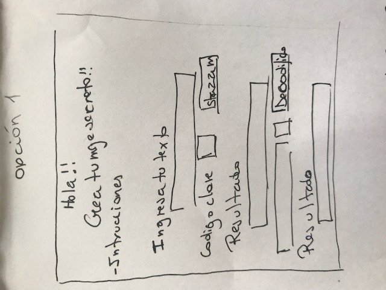
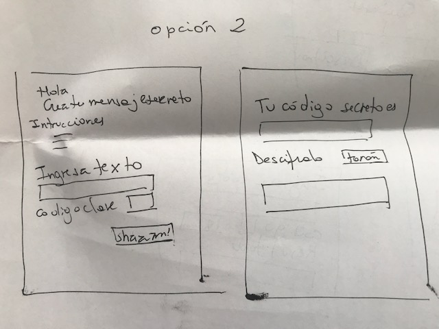
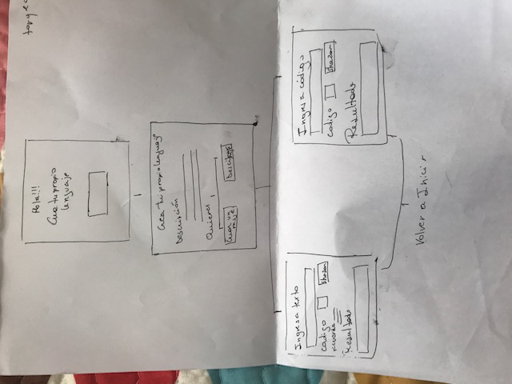
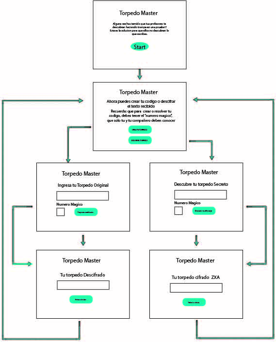
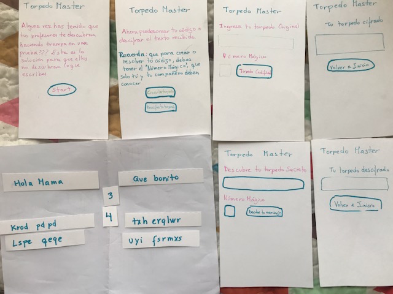

# Torpedo Master

----
## ¿Qué es "Torpedo Master"?

> Aplicación creada para crear mensajes secretos para "torpedos". En esta pagina puedes crear códigos secretos o descifrar los mensajes secretos que se reciben.

Para esto usamos  *"Cifrado Cesar"*. El cifrado césar es una de las técnicas más simples para cifrar un mensaje. Es un tipo de cifrado por sustitución, es decir que cada letra del texto original es reemplazada por otra que se encuentra un número fijo de posiciones (desplazamiento) más adelante en el mismo alfabeto.
Por ejemplo, si usamos un desplazamiento (_offset_) de 3 posiciones:

- La letra A se cifra como D.
- La palabra CASA se cifra como FDVD.
- Alfabeto sin cifrar: A B C D E F G H I J K L M N O P Q R S T U V W X Y Z
- Alfabeto cifrado: D E F G H I J K L M N O P Q R S T U V W X Y Z A B C

Es por ello que para crear "Torpedo Master" usamos el, Codigo Cesar, un codigo que se puede crear facilmente.

----
## Diseño

>Diseño simple, con reglas básica para que el usuario sepa seguir los pasos a seguir.

*Proceso de Diseño*

* Identificar tema a tratar:  
Optamos por  el tema de "torpedos", con el fin de ayudar a estudiantes a codificar sus mensajes en clases.
Para esto se decidió hacer un diseño amigable, que mostrara solo lo que el usuario quería ver. 

* Creación de maqueta:     
  Para esto se creo primero la siguiente maqueta:
  

  Luego se decidió hacer una mas compleja para hacer un mejor diseño:   
  
   Finalmente se decidio el siguiente flujo:
  

En resumen, despues de las pruebas se llegó a lo siguiente:

  

----
## Usuarios
> El usuario de "Torpedo Master" son estudiantes de 14 a 25 años. Estudiantes de enseñanza media y superior.

* Objetivos :  El usuario busca un producto que solucione la necesidad de poder comunicarse con sus compañeros de clases.
  
* Solución de problemas:   El usuario encuentra una herramienta para facilitar la comunicación entre sus compañeros, evitando que sepan que se comunica.

----
## Como usar
>Como ya se explico anteriormente, esta pagina usa el cifrado cesar. Para poder usarlo, lo explicaremos en los siguientes pasos:

* Ingreso a la pagina:  Pagina de inicio que explica de que trata la página.
* Elegir entre "crear un mensaje secreto, o "resolver mensaje secreto".
* Ingresar mensaje o mensaje a descifrar.
* Ingresar "Número Mágico" o numero secreto para crear o revelar mensaje.
* Apretar botón para cifrar o descifrar.
* Se revela mensaje
* Se da la opción de volver a inicio (opciones).

En los campos de texto se pueden usar los siguente para ser cifrado: minusculas, mayusculas, números y letra Ñ.

##User Experience
>Para mejorar el tema elegido se ideó hacer un estudio, para ver que necesitaba el usuario y un testeo para ver que le gustaría mejorar al usuario

* Testeo e Iteración: 
 Para realizar un mejor proyecto se realizó un testeo con 5 usuarios con edades entre 14 y 21 años.
**Metodologia**
Se realizó una maqueta con 6 laminas, en las cuales los usuarios podían cambiar de pagina y elegir entre las opciones presentadas.
Tambíén contaba con variables, para que el usuario eligiera entre diferentes mensajes,  para poder ver los resultados que mostraría "Torpedo Master".
Maqueta y variables (frases y números mágicos).
  

A continuación podemos ver la experiencia de un usuario al usar la maqueta:
* [experiencia usuario maqueta](https://youtu.be/fWJixF9bYD0)

**Conclusión de testeo** Después de realizar el estudio con la maquetas se consiguieron las siguientes conclusiones:

* Usuario necesita botón para volver a Inicio

* Integrar números y letra Ñ.

* Al volver tienen que ser limpiados los campos

Luego de esto se también se realizo un testeo de la página que ya tenia los cambios estudiados con la maqueta.

* [experiencia usuario maqueta](https://youtu.be/opVUEUwnMto)

